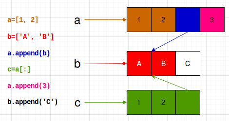

# Session 3

**Date**: 28-June-2020

Content
-------

## Data Structures

1. List
2. Tuple
3. Set
4. Dictionary

### List

* List can store objects of **any** type.

```python
# Storing int, float, str and NoneType in a list
>>> l1 = [1, 1.5, "A", None]
>>> type(l1)
<class 'list'>
```

* Creating a list from a string (iterable).

```python
>>> l2 = list("ABCD")
>>> l2
['A', 'B', 'C', 'D']
```

* Creating a list using `range(start, stop, step)`

```python
# Create a list of first 5 integers
>>> l3 = list(range(5))
>>> l3
[0, 1, 2, 3, 4]

# Create a list in the range 5 to 10.
>>> l3 = list(range(5,10))
>>> l3
[5, 6, 7, 8, 9]

# Create list of odd numbers between 1 to 20
>>> l3 = list(range(1,21,2))
[1, 3, 5, 7, 9, 11, 13, 15, 17, 19]
```

* Empty list evaluates to `False`, otherwise `True`.

```python
>>> l1 = []
>>> bool(l1)
False
>>> l1 = [1, 3]
>>> bool(l1)
True

# Note that the list is not empty as None is an element in the list.
>>> bool([None])
True
```

* Get count of elements in a list using `len()` function.

```python
>>> l1 = [1, 2, 'A', None]
>>> len(l1)
4
```

* Elements in the list are indexed. To get elements from the end of list, use **negative index**.

```python
>>> l1 = [0, 1, 2, 3, 4, 5, 6, 7]
>>> len(l1)
8
>>> l1[0]
0
>>> l1[1]
1
>>> l1[5]
5

# Get last element
>>> l1[-1]
7

# Get 3rd last element
>>> l1[-3]
5
```

* You can create a sublist from a list (same as string slicing).
* Syntax is `l1[start : stop : step ]`
* `start`, `stop` and `step` - all are optional.
* Default values -
	* `start` = 0
	* `stop` = end of list
	* `step` = 1

```python
>>> l1
[0, 1, 2, 3, 4, 5, 6, 7]

# Get first 3 elements from the list (start is optional, defaults to 0)
>>> l1[0:3]
[0, 1, 2]
>>> l1[:3]
[0, 1, 2]

# Get first 5 elements from the list
>>> l1[:5]
[0, 1, 2, 3, 4]

# Get all the elements of the list starting at index 3
>>> l1[3:]
[3, 4, 5, 6, 7]

# Get 4 elements from the list, starting at index 2
# Default value of step=1
>>> l1[2:6]
[2, 3, 4, 5]
>>> l1[2:6:1]
[2, 3, 4, 5]

# Get elements from index 2 to 5, with step=2
>>> l1[2:6:2]
[2, 4]

# Get elements in the list at even index positions
>>> l1[::2]
[0, 2, 4, 6]

# Reverse a list
>>> l1[::-1]
[7, 6, 5, 4, 3, 2, 1, 0]

# Reverse a list with step of 2
>>> l1[::-2]
[7, 5, 3, 1]
>>> 
```

* What all functions supported by a list?

```python
>>> dir(list)
['__add__', '__class__', '__contains__', '__delattr__', '__delitem__', '__dir__', '__doc__', '__eq__', '__format__', '__ge__', '__getattribute__', '__getitem__', '__gt__', '__hash__', '__iadd__', '__imul__', '__init__', '__init_subclass__', '__iter__', '__le__', '__len__', '__lt__', '__mul__', '__ne__', '__new__', '__reduce__', '__reduce_ex__', '__repr__', '__reversed__', '__rmul__', '__setattr__', '__setitem__', '__sizeof__', '__str__', '__subclasshook__', 'append', 'clear', 'copy', 'count', 'extend', 'index', 'insert', 'pop', 'remove', 'reverse', 'sort']

# Get help to understand what append function does
>>> help(list.append)
```  

* **append vs. extend**
	* `append()` - Append **object** to the end of the list.
	* `extend()` - Extend list by appending elements from the **iterable**.

```python
# append example
>>> a
[1, 2, 3]
>>> b = ['A', 'B']
>>> len(a)
3
>>> a.append(b)
>>> a
[1, 2, 3, ['A', 'B']]
>>> len(a)
4

# extend example
>>> a = [1, 2, 3]
>>> b
['A', 'B']
>>> a.extend(b)
>>> a
[1, 2, 3, 'A', 'B']
>>> len(a)
5
```

* List is **mutable**.

```python
>>> l1 = [1, 2]
>>> id(l1)
140047740552456

>>> l1.append(3)

# l1 is mutable, because value of the object has changed but not its address
>>> l1
[1, 2, 3]
>>> id(l1)
140047740552456
```

* When you pass a list to a function, it is **pass by reference**.

```python
def my_fun(b):
    b.append('apple')
    return None

basket = ['mango', 'grapes']
print(f"Before: {basket}")
my_fun(basket)
print(f"After: {basket}")

# Output:
Before: ['mango', 'grapes']
After: ['mango', 'grapes', 'apple']
```

#### By Reference vs. Shallow Copy vs. Deep Copy

##### By Reference

* When you assign a list to another identifier, it is **by reference**.

```python
>>> a = [1, 2, 3]
>>> b = a
>>> b
[1, 2, 3]
>>> b.append('FOUR')
>>> b
[1, 2, 3, 'FOUR']

# Though 'FOUR` was appended via reference b, a has also changed.
>>> a
[1, 2, 3, 'FOUR']

# Both a and b point to same object in memory.
>>> id(a)
140047739703176
>>> id(b)
140047739703176
```

##### Shallow Copy

`b = a[:]` creates a shallow copy of `a` and `b` points to that.

```python
>>> a
[1, 2, 3, 'FOUR', 5]

# Shallow Copy
>>> b = a[:]

# Address of objects pointed by a and b are different.
>>> id(a)
140047739703176
>>> id(b)
140047740279432

# append to b doesn't change a - as they are two different objects.
>>> b.append(6)
>>> b
[1, 2, 3, 'FOUR', 5, 6]
>>> a
[1, 2, 3, 'FOUR', 5]
```

##### Deep Copy

What if I have a list within a list, and do a shallow copy?

```python
>>> a = [1, 2]
>>> b = ['A', 'B']
>>> a
[1, 2]
>>> b
['A', 'B']
>>> a.append(b)
>>> a
[1, 2, ['A', 'B']]

# Shallow Copy
>>> c = a[:]
>>> a
[1, 2, ['A', 'B']]
>>> b
['A', 'B']
>>> c
[1, 2, ['A', 'B']]

# Append 3 to a will not impact c becuase I have done shallow copy
>>> a.append(3)
>>> a
[1, 2, ['A', 'B'], 3]
>>> c
[1, 2, ['A', 'B']]

# What if I append an "C" to list b? - It changes all the lists.
>>> b.append('C')
>>> b
['A', 'B', 'C']
>>> a
[1, 2, ['A', 'B', 'C'], 3]
>>> c
[1, 2, ['A', 'B', 'C']]
```

Visual representation of above operations.



If I also want to copy all the mutable objects within a list, then I need to `deepcopy`.

```python
# Deep copy to list a into x
>>> from copy import deepcopy
>>> x = deepcopy(a)
>>> x
[1, 2, ['A', 'B', 'C'], 3]

# Changing b will not impact x
>>> b.append('Sami')
>>> b
['A', 'B', 'C', 'Sami']
>>> a
[1, 2, ['A', 'B', 'C', 'Sami'], 3]
>>> c
[1, 2, ['A', 'B', 'C', 'Sami']]
>>> x
[1, 2, ['A', 'B', 'C'], 3]
```

FAQ
---

**Q1.** How to get count of references to an object?

**A.** [Click Here](https://stackoverflow.com/questions/510406/is-there-a-way-to-get-the-current-ref-count-of-an-object-in-python)

```python
>>> a = [1,2]
>>> b=a

# There reference count is 1 higher because of temp reference.
>>> import sys
>>> sys.getrefcount(a)
3
```

Homework
--------

1. Play with different functions supprted by list. Hint: `dir(list)`
2. Let `l1 = [1, 2, 3, 4, 5, 6]`. Create a new list `l2` by chopping off last two elements of `l1`. 
