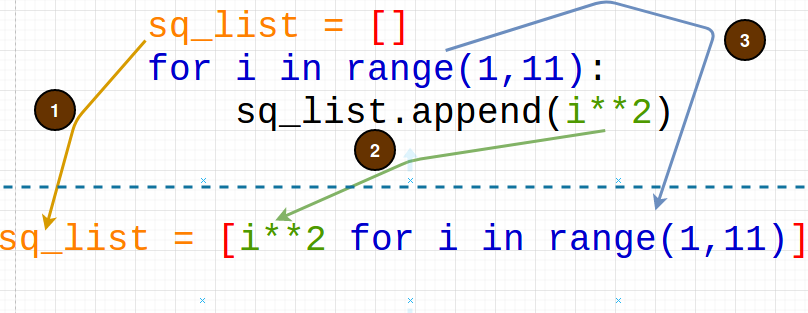

# Session 5

**Date**: 05-July-2020

Content
-------

## Control Structures (continue...)

### Membership Operator `in`

Return `True` if an element is member of a list


```python
>>> a = [1, 2, 3, 4]
>>> 1 in a
True
>>> 100 in a
False
>>> 'io' in 'aeiou'
True
>>> 'j' in 'aeiou'
False
```

### `==` vs. `is`

There is difference between two object being identical vs. equal.

```python
>>> a = [1, 2, 3, 4]

# Assign reference of b to a
>>> b = a

# Shallow copy object referenced by a and assign it to c
>>> c = a[:]

# == checks if both the list variables contain same elements
>>> a == b
True
>>> a == c
True

# is operator checks if both the variables point to same object
>>> a is b
True

# As c is copy of a at different memory location, it is equal but not identical - therefore False
>>> a is c
False
>>> id(a)
140491231515912
>>> id(b)
140491231515912
>>> id(c)
140491231516872
```

## Data Structures (continue...)

### Set

* Set is *mutable*.

```python
# Creating a set
>>> s1 = {1, 2, 3, 4}
>>> type(s1)
<class 'set'>

# Creating an empty set
>>> s1=set()
>>> type(s1)
<class 'set'>

# Set will have unique elements
>>> s1 = {1, 2, 3, 3, 2, 2, 3}
>>> s1
{1, 2, 3}

# Removing duplicates from a list
>>> cities = ['Delhi', 'Mumbai', 'Mumbai', 'Delhi']
>>> set(cities)
{'Mumbai', 'Delhi'}

# You can't access set elements by index, use for..in loop
>>> s1
{1, 2, 3, 4}
>>> s1[0]
Traceback (most recent call last):
  File "<stdin>", line 1, in <module>
TypeError: 'set' object does not support indexing
>>> for i in s1:
...     print(i)
... 
1
2
3
4
```

* **Set Operations** - Union `|`, Intersection `&`, Difference `-` and Symmetric Differene `^`

```python
>>> s1 = {1, 2, 3, 4}
>>> s2 = {3, 4, 5, 6}

# Union
>>> s1 | s2
{1, 2, 3, 4, 5, 6}

# Intersection
>>> s1 & s2
{3, 4}

# Difference
>>> s1-s2
{1, 2}
>>> s2-s1
{5, 6}

# Symmmetric Difference
>>> s1^s2
{1, 2, 5, 6}
```

* Other set operations -

```python
>>> dir(set)
['__and__', '__class__', '__contains__', '__delattr__', '__dir__', '__doc__', '__eq__', '__format__', '__ge__', '__getattribute__', '__gt__', '__hash__', '__iand__', '__init__', '__init_subclass__', '__ior__', '__isub__', '__iter__', '__ixor__', '__le__', '__len__', '__lt__', '__ne__', '__new__', '__or__', '__rand__', '__reduce__', '__reduce_ex__', '__repr__', '__ror__', '__rsub__', '__rxor__', '__setattr__', '__sizeof__', '__str__', '__sub__', '__subclasshook__', '__xor__', 'add', 'clear', 'copy', 'difference', 'difference_update', 'discard', 'intersection', 'intersection_update', 'isdisjoint', 'issubset', 'issuperset', 'pop', 'remove', 'symmetric_difference', 'symmetric_difference_update', 'union', 'update']
>>> s1
{1, 2, 3, 4}
>>> s1.pop()
1
>>> s1
{2, 3, 4}
>>> 
```

### Dictionary

* Dictionary contains pair(s) of key,value. (like HashMap or AssociativeArray in other languages)
* The keys are ordered in Python3.

```python
# Creating a dictionary
>>> d = {'India': 'Delhi'}
>>> type(d)
<class 'dict'>

# Creating a dictionary using dict function
>>> d = dict(a=1,b=2,c=3)
>>> d
{'a': 1, 'b': 2, 'c': 3}
>>> type(d)
<class 'dict'>

# Create an empty dictionary
>>> d1 = {}
>>> type(d1)
<class 'dict'>
```

* Operations on a dictionary -

```python
>>> student = {1: 'A', 2: 'B', 3: 'C'}

# Getting a value by passing the key
>>> student[3]
'C'

# Updating a value
>>> student[2] = 'Bob'
>>> student
{1: 'A', 2: 'Bob', 3: 'C'}

# If the key doesn't exist, it raises KeyError
>>> student[100]
Traceback (most recent call last):
  File "<stdin>", line 1, in <module>
KeyError: 100

# get function - returns value for the key if it exists, else returns a default value
>>> student.get(100, 'DUMMY')
'DUMMY'
>>> student.get(2, 'DUMMY')
'Bob'

# Adding a new key
>>> student[4] = 'James'
>>> student
{1: 'A', 2: 'Bob', 3: 'C', 4: 'James'}

# Deleting a key from a dict
>>> del student[3]
>>> student
{1: 'A', 2: 'Bob', 4: 'James'}
```

**Q.** Write a program to get frequency distribution of words in a sentence.

```python
sentence="It is raining When it is raining I play football Do you play when it is raining"

# Extract words from the sentence
words = sentence.split(' ')

# Count frequency of occurence of each word
word_count = {}
for w in words:
    value=word_count.get(w, 0)
    value+=1
    word_count[w]=value

print(word_count)

# Output
{'It': 1, 'is': 3, 'raining': 3, 'When': 1, 'it': 2, 'I': 1, 'play': 2, 'football': 1, 'Do': 1, 'you': 1, 'when': 1}
```

* The value in a dictionary can be of **any** type.

```python
>>> d = {'a': 1, 'b': 2.0, 'c': 'XYZ', 'd': [1,2], 'e': (9,10), 'f': dict(A=10,B=20) }
>>> d['a']
1
>>> d['b']
2.0
>>> d['c']
'XYZ'
>>> d['d']
[1, 2]
>>> d['e']
(9, 10)
>>> d['f']
{'A': 10, 'B': 20}
```

* The key of a dictionary should be **hashable**.

```python
# A hashable tuple can be a key in a dictionary
>>> d = { (2,'Ebaad') :'Thane', (3, 'Ebaad'): 'Mumbai' }
>>> d[(3, 'Ebaad')]
'Mumbai'

# List is mutable, so it is unhashable. Hence can't be used as key.
>>> d = { [2,'Ebaad'] :'Thane', [3, 'Ebaad']: 'Mumbai' }
Traceback (most recent call last):
  File "<stdin>", line 1, in <module>
TypeError: unhashable type: 'list'
```

* To check if hashable, use `hash()`

```python
# A hashable tuple can be used as key in dictionary
>>> t = (1, 'Ebaad')
>>> hash(t)
874262456280779260
>>> d={t:'X'}
>>> d
{(1, 'Ebaad'): 'X'}

# A tuple containing mutable list is unhashable, therefore can't be used as a key in dictionary
>>> t = (1, 'Ebaad', [4,5])
>>> hash(t)
Traceback (most recent call last):
  File "<stdin>", line 1, in <module>
TypeError: unhashable type: 'list'
```

* Accessing keys and values in a dictionary -

```python
>>> country = {'India': 'Delhi', 'Bangladesh': 'Dhaka', 'Pakistan': 'Islamabad', 'China': 'Bejieng', 'Russia': 'Moscow'}
>>> country.keys()
dict_keys(['India', 'Bangladesh', 'Pakistan', 'China', 'Russia'])
>>> country.values()
dict_values(['Delhi', 'Dhaka', 'Islamabad', 'Bejieng', 'Moscow'])
```

* Iterating over a dictionary using `for..in` loop

```python
>>> for key in country:
...     print (key)
... 
India
Bangladesh
Pakistan
China
Russia

>>> for key in country:
...     country[key]
... 
'Delhi'
'Dhaka'
'Islamabad'
'Bejieng'
'Moscow'
```

* Using `items()` with `for..in` loop

```python
>>> country.items()
dict_items([('India', 'Delhi'), ('Bangladesh', 'Dhaka'), ('Pakistan', 'Islamabad'), ('China', 'Bejieng'), ('Russia', 'Moscow')])

>>> for key,value in country.items():
...     print(f"Capital of {key} is {value}.")
... 
Capital of India is Delhi.
Capital of Bangladesh is Dhaka.
Capital of Pakistan is Islamabad.
Capital of China is Bejieng.
Capital of Russia is Moscow.
```

#### Comprehensions

##### List Comprehension

* Use when you want to create a new list from an iterable.

```python
# Create a list of squares between 1 to 10.

# Traditional
sq_list = []
for i in range(1,11):
    sq_list.append(i**2)

# List Comprehension
sq_list = [i**2 for i in range(1,11)]

# Output
>>> sq_list
[1, 4, 9, 16, 25, 36, 49, 64, 81, 100]
```



```python
# Create a list of squares of odd numbers between 1 to 10.

# List comprehension with if condition
>>> sq_list = [i**2 for i in range(1,11) if i%2!=0]
>>> sq_list
[1, 9, 25, 49, 81]
```

* Don't use Comprehension if you have nested `for` loops, as it makes code unreadable. 

##### Dict Comprehension

* It is used to create a dictionary from an iterable.

```python
# Create a dictionary with number as key and its cube as value for numbers divisible by 3 between 1 to 10.
>>> cube_dict = {i:i**2 for i in range(1,11) if i%3==0}
>>> cube_dict
{3: 9, 6: 36, 9: 81}
```

Homework
--------

1. Explore functions supported by `set` and `dict`. Also read about `frozenset`.
2. Write a program to generate an array of size `n` with `k` inversions. **Hint**: [Inversions in an array](https://www.geeksforgeeks.org/counting-inversions/)
3. Write a program to find anagrams in a given list of words.

```python
# Input
words = ['Bag', 'State', 'Cat', 'Night', 'Bat', 'Apple', 'Listen', 'Dusty', 'Thing', 'Act', 'Inch', 'Nest', 'Funeral', 'dog', 'Bird', 'Silent', 'God', 'Chin', 'Study', 'Taste']

# Output
['State', 'Taste']
['Cat', 'Act']
['Night', 'Thing']
['Listen', 'Silent']
['Dusty', 'Study']
['Inch', 'Chin']
['dog', 'God']
```

4. Write a program to read text from url `http://sixty-north.com/c/t.txt` and find frequency distribution of words. **Hint:** Refer [WordExtraction Notebook](WordExtraction.ipynb)
5. Given a `capitals` dictionary, Write a program to print it in
	1. Lexical order of Country Name
	2. Descending order of Country Name length

```python
capitals = {'India': 'Delhi', 'Bangladesh': 'Dhaka', 'England': 'London', 'Canada': 'Ottawa'}
```


	
